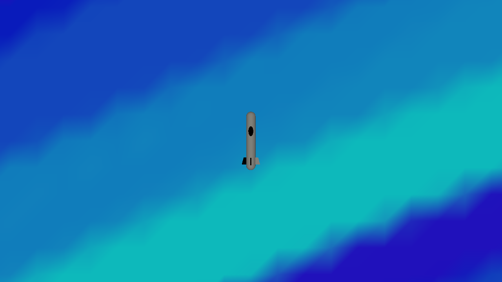

# Submarines

Author: Jingguo Liang

Design: A game using sound to track down and destroy enemy submarines

Screen Shot:

How To Play:

Use up arrow to move forward, left and right arrow to turn, z to fire. Enemies are completely invisible. Player will emit a sonar wave every few seconds to scan enemies with a certain radius. If there are enemies within, there will be another sonar sound feedback. The feedback differs in volume and time-gap depending on the distance with player. Press z to fire a torpedo. The torpedo has a 10s cooldown, and will travel in the direction in which it is fired. On hit, there will be sound feedback.

This game was built with [NEST](NEST.md), on Windows platform.
